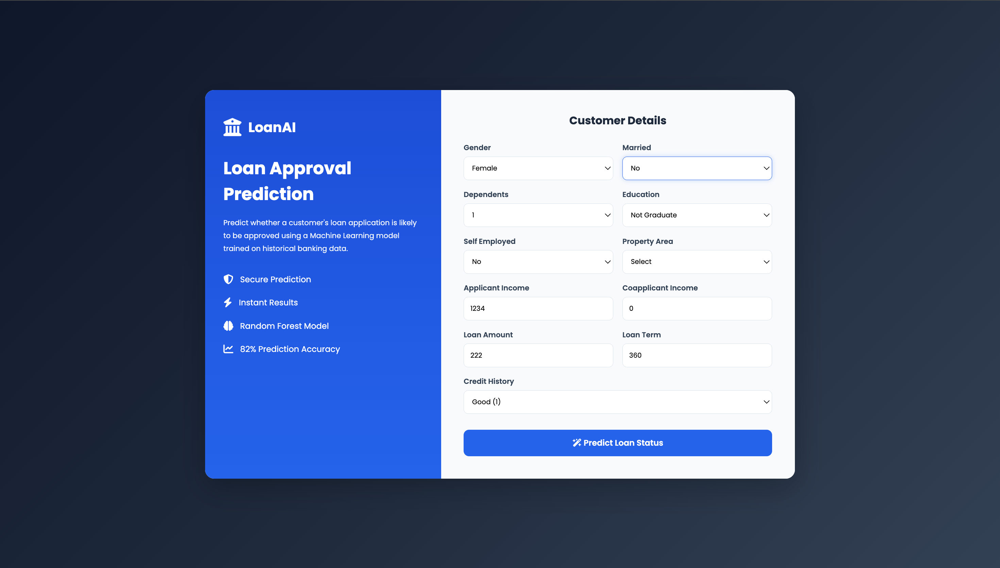
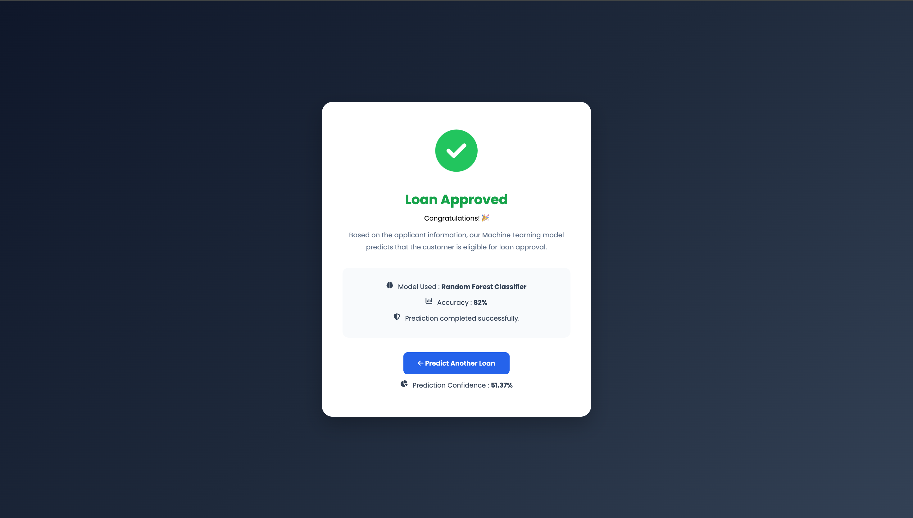

# 🏦 Loan Approval Prediction using Machine Learning

📌 Project Overview

Loan approval is a critical decision-making process in the banking and financial sector. Financial institutions evaluate multiple customer attributes before deciding whether an applicant is eligible for a loan.

This project leverages Machine Learning to predict whether a customer’s loan application is likely to be Approved or Rejected based on applicant information such as income, education, employment status, credit history, loan amount, and property area.

A complete end-to-end machine learning pipeline has been implemented, including:

* Data Cleaning
* Exploratory Data Analysis (EDA)
* Feature Engineering
* Model Building
* Hyperparameter Tuning
* Model Evaluation
* Flask Web Application
* Deployment Ready

⸻

🚀 Live Demo

https://loan-prediction-system-i8op.onrender.com/

⸻

📷 Application Screenshots

## 🏠 Home Page

⸻

## ✅ Loan Approved

⸻

## ❌ Loan Rejected

screenshots/rejected.png

⸻

🎯 Problem Statement

Banks receive thousands of loan applications every day.

Manually evaluating each application is time-consuming and prone to inconsistency.

The objective of this project is to build a Machine Learning model capable of predicting loan approval based on customer information, helping financial institutions make faster and more consistent decisions.

⸻

📂 Dataset Features

Feature	Description
Gender	Applicant Gender
Married	Marital Status
Dependents	Number of Dependents
Education	Education Level
Self_Employed	Employment Status
ApplicantIncome	Monthly Applicant Income
CoapplicantIncome	Monthly Coapplicant Income
LoanAmount	Requested Loan Amount
Loan_Amount_Term	Loan Repayment Term
Credit_History	Credit History Status
Property_Area	Urban / Rural / Semiurban
Loan_Status	Target Variable

⸻

⚙️ Machine Learning Workflow

Business Problem
        ↓
Data Collection
        ↓
Data Cleaning
        ↓
Missing Value Handling
        ↓
Exploratory Data Analysis
        ↓
Outlier Analysis
        ↓
Feature Engineering
        ↓
Encoding
        ↓
Correlation Analysis
        ↓
Train-Test Split
        ↓
Model Training
        ↓
Hyperparameter Tuning
        ↓
Model Evaluation
        ↓
Flask Web Application
        ↓
Prediction

⸻

📊 Exploratory Data Analysis

Performed extensive Exploratory Data Analysis including:

* Distribution Analysis
* Missing Value Analysis
* Outlier Detection
* Boxplots
* Countplots
* Correlation Heatmap
* Feature vs Target Analysis
* GroupBy Analysis

⸻

🛠 Feature Engineering

The following engineered features were created to improve model performance.

✔ Total Income

TotalIncome = ApplicantIncome + CoapplicantIncome

✔ Loan Income Ratio

LoanIncomeRatio = LoanAmount / TotalIncome

These features provide additional insights into the applicant’s repayment capability.

⸻

🤖 Machine Learning Models

The following classification algorithms were trained and evaluated:

* Logistic Regression
* K-Nearest Neighbors (KNN)
* Support Vector Machine (SVM)
* Decision Tree
* Random Forest
* Gaussian Naive Bayes

⸻

📈 Model Evaluation Metrics

Models were evaluated using:

* Accuracy
* Precision
* Recall
* F1 Score
* ROC-AUC Score
* Confusion Matrix
* Classification Report
* Cross Validation

⸻

🏆 Best Performing Model

Random Forest Classifier

Hyperparameter tuning was performed using GridSearchCV.

Best Parameters

n_estimators = 200
max_depth = 10
min_samples_split = 10
min_samples_leaf = 1

⸻

📊 Final Performance

Metric	Score
Accuracy	82%
Cross Validation Accuracy	82.09%
Algorithm	Random Forest
Hyperparameter Tuning	GridSearchCV

⸻

🌐 Web Application

A professional Flask application was developed for real-time loan prediction.

Features

* Modern Banking UI
* Responsive Design
* Professional Dashboard
* Separate Result Page
* Approval & Rejection Screen
* Instant Prediction
* Deployment Ready

⸻

🧰 Technologies Used

Programming Language

* Python

Machine Learning

* Scikit-Learn

Data Analysis

* Pandas
* NumPy

Data Visualization

* Matplotlib
* Seaborn

Backend

* Flask

Frontend

* HTML5
* CSS3

Deployment

* Render

⸻

📁 Project Structure

Loan-Approval-Prediction
│
├── app.py
├── best_rf.pkl
├── requirements.txt
├── runtime.txt
├── Procfile
├── README.md
├── .gitignore
│
├── static
│   └── style.css
│
├── templates
│   ├── index.html
│   └── result.html
│
└── screenshots
    ├── home.png
    ├── approved.png
    └── rejected.png

⸻

💻 Installation

Clone the repository

git clone https://github.com/your-username/Loan-Approval-Prediction.git

Go to the project directory

cd Loan-Approval-Prediction

Install dependencies

pip install -r requirements.txt

Run the application

python app.py

Open your browser

http://127.0.0.1:5000

⸻

🚀 Deployment

This project is deployment-ready using Render.

Build Command

pip install -r requirements.txt

Start Command

gunicorn app:app

⸻

📚 Key Learnings

Through this project I gained practical experience in:

* Data Cleaning
* Missing Value Handling
* Exploratory Data Analysis
* Feature Engineering
* Feature Encoding
* Correlation Analysis
* Classification Algorithms
* Hyperparameter Tuning
* Model Comparison
* Cross Validation
* Flask Development
* Machine Learning Deployment

⸻

🔮 Future Improvements

* Explainable AI (SHAP)
* Probability Gauge
* Loan Eligibility Score
* User Authentication
* Database Integration
* EMI Calculator
* PDF Report Generation
* Docker Deployment
* Cloud Database Integration

⸻

🤝 Contributing

Contributions, issues, and feature requests are welcome.

Feel free to fork this repository and submit a pull request.

⸻

👨‍💻 Author

Harsha Paloju

AI & Machine Learning Enthusiast

* GitHub: https://github.com/harsha-paloju
* LinkedIn: https://linkedin.com/in/harsha-paloju-44388239b

⸻

⭐ Support

If you found this project helpful, consider giving it a ⭐ on GitHub.

It motivates me to build more Machine Learning and AI projects.

⸻

📄 License

This project is licensed under the MIT License.
